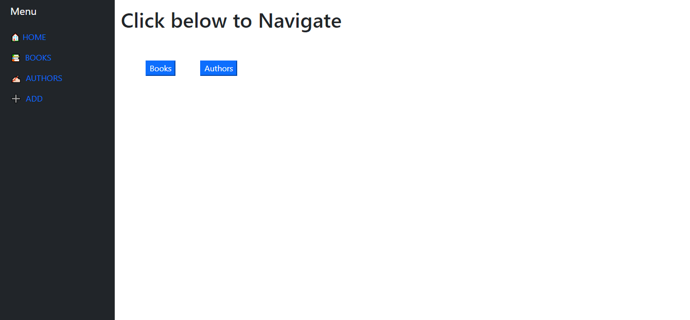
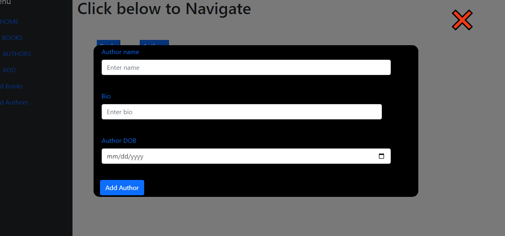
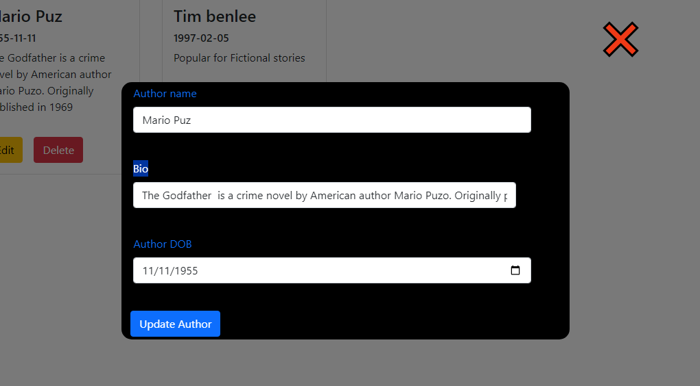
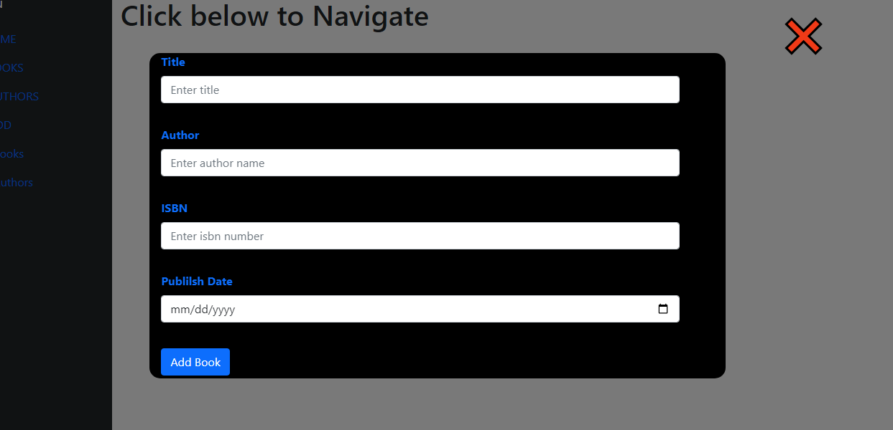
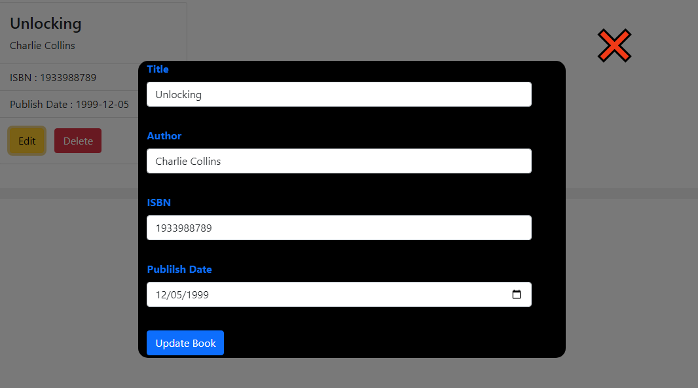

## AXIOS_TASK

# HOW TO RUN THE APPLICATION

- First clone the repository

- Open cmd on the same path

- Then run npm install

- And then npm install axios

- And then npm install react-router-dom

- And then npm install yub

- And then npm install formik

- Then npm run dev

# WORK ON APPLICATION

- This is application main page

## HANDLE AUTHORS

- You want add new Author to click the plus icon

- Choose Author to click the Add Authors

- And it's show popup

- Enter the detailes and add a Author

- If you want delete the existing Author navigate Author click the delete button

- If you want edit the existing Author navigate Author click the edit button

  

- Enter the updated detailes and click update Author

## HANDLE BOOKS

- You want add new Book to click the plus icon

- Choose Book to click the Add Books

- And it's show popup

- Enter the detailes and add a Book

- If you want delete the existing Book navigate Book click the delete button

- If you want edit the existing Book navigate Book click the edit button

- Enter the updated detailes and click update Book
